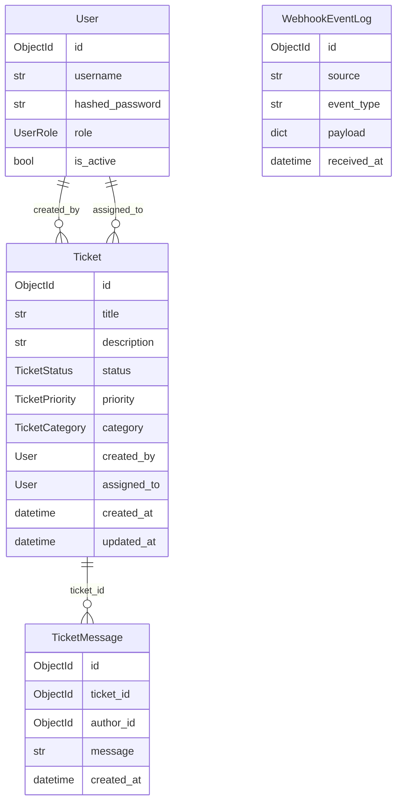
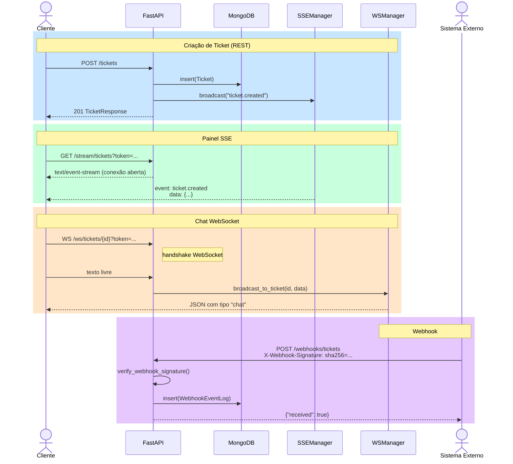

# TicketFlow API Demo

Sistema didático de suporte técnico em tempo real, desenvolvido com **FastAPI**, **Pydantic v2**, **Beanie** e **MongoDB**.

## Visão Geral

O **TicketFlow API Demo** é um projeto pedagógico que demonstra, em um único backend coeso, quatro paradigmas de comunicação distintos:

| Protocolo | Endpoint | Direção | Caso de uso |
|-----------|----------|---------|-------------|
| REST (HTTP) | `/tickets`, `/auth`, `/webhooks` | Bidirecional por requisição | Operações CRUD, autenticação |
| SSE | `/stream/tickets` | Servidor → Cliente | Painel de monitoramento em tempo real |
| WebSocket | `/ws/tickets/{id}` | Bidirecional e persistente | Chat ao vivo por ticket |
| Webhook | `/webhooks/tickets` | Sistema externo → API | Integração com sistemas de terceiros |

---

## Pré-requisitos

- Python 3.11+
- MongoDB (local ou Atlas)

---

## Instalação

```bash
git clone https://github.com/Romario17/TicketFlow-API-Demo.git
cd TicketFlow-API-Demo
python -m venv .venv && source .venv/bin/activate
pip install -r requirements.txt
```

Ou, via `pyproject.toml`:

```bash
pip install -e .          # modo desenvolvimento (editable install)
pip install -e ".[dev]"   # modo desenvolvimento + ferramentas (ruff)
```

### Variáveis de ambiente (opcional — `.env`)

Copie o template e ajuste os valores:

```bash
cp .env.template .env
```

```env
MONGODB_URL=mongodb://localhost:27017
MONGODB_DB_NAME=ticketflow
SECRET_KEY=CHANGE_THIS_SECRET_IN_PRODUCTION
WEBHOOK_SECRET=CHANGE_THIS_WEBHOOK_SECRET
ACCESS_TOKEN_EXPIRE_MINUTES=60
```

---

## Execução

### Local

```bash
uvicorn app.main:app --reload
```

### Docker

```bash
cp .env.template .env   # edite os valores conforme necessário
docker compose up --build
```

Acesse o cliente de demonstração em: **http://localhost:8000**

Documentação interativa (Swagger UI): **http://localhost:8000/docs**

---

## Estrutura do Projeto

```
app/
├── main.py                    # Ponto de entrada FastAPI
├── core/
│   ├── config.py              # Configurações (pydantic-settings)
│   ├── database.py            # Inicialização Beanie/Motor
│   ├── security.py            # JWT e bcrypt
│   ├── sse.py                 # Gerenciador SSE (asyncio.Queue)
│   └── websocket_manager.py   # Gerenciador WebSocket por ticket
├── models/
│   ├── user.py                # Documento Beanie: User
│   ├── ticket.py              # Documento Beanie: Ticket + Enums
│   ├── ticket_message.py      # Documento Beanie: TicketMessage
│   └── webhook_event.py       # Documento Beanie: WebhookEventLog
├── schemas/
│   ├── auth.py                # Schemas Pydantic: Auth
│   ├── ticket.py              # Schemas Pydantic: Ticket
│   ├── ticket_message.py      # Schemas Pydantic: Message
│   └── webhook.py             # Schemas Pydantic: Webhook
├── routers/
│   ├── auth.py                # POST /auth/register, /auth/login, GET /auth/me
│   ├── tickets.py             # CRUD de tickets
│   ├── messages.py            # Mensagens por ticket
│   ├── stream.py              # GET /stream/tickets (SSE)
│   ├── ws.py                  # WS /ws/tickets/{id}
│   └── webhooks.py            # POST /webhooks/tickets
├── dependencies/
│   └── auth.py                # Dependências FastAPI: get_current_user, require_roles
├── services/
│   ├── auth_service.py        # Lógica de autenticação
│   ├── ticket_service.py      # Lógica de tickets + notificações SSE
│   ├── webhook_service.py     # Validação HMAC e persistência de eventos
│   └── stream_service.py      # Gerador SSE
└── static/
    └── index.html             # Cliente HTML/JS de demonstração
```

---

## Contratos de API

### Autenticação

| Método | Rota | Descrição |
|--------|------|-----------|
| POST | `/auth/register` | Cria usuário (`customer`, `agent`, `manager`) |
| POST | `/auth/login` | Autentica e retorna JWT |
| GET | `/auth/me` | Retorna perfil do usuário autenticado |

### Tickets

| Método | Rota | Papel requerido |
|--------|------|-----------------|
| POST | `/tickets` | Qualquer usuário autenticado |
| GET | `/tickets` | Qualquer usuário autenticado |
| GET | `/tickets/{id}` | Qualquer usuário autenticado |
| PATCH | `/tickets/{id}/status` | `agent` ou `manager` |
| PATCH | `/tickets/{id}/assign` | `manager` |

### Mensagens

| Método | Rota | Descrição |
|--------|------|-----------|
| POST | `/tickets/{id}/messages` | Envia mensagem REST (também notifica via WebSocket) |
| GET | `/tickets/{id}/messages` | Lista mensagens do ticket |

### Stream e WebSocket

| Protocolo | Rota | Autenticação |
|-----------|------|--------------|
| SSE | `GET /stream/tickets?token=<jwt>` | Query param (EventSource não suporta headers) |
| WebSocket | `WS /ws/tickets/{id}?token=<jwt>` | Query param (RFC 6455) |

### Webhook

| Método | Rota | Cabeçalho |
|--------|------|-----------|
| POST | `/webhooks/tickets` | `X-Webhook-Signature: sha256=<hmac>` |

---

## Modelo de Domínio



---

## Fluxo de Comunicação



---

## Segurança

- **JWT**: tokens assinados com HMAC-SHA256 (HS256) via `python-jose`.
- **Senhas**: armazenadas com hash bcrypt via `passlib`.
- **Webhook**: assinatura HMAC-SHA256 comparada com `hmac.compare_digest` (resistente a timing attacks).
- **Autorização por papel**: `require_roles()` injeta verificação declarativa nos endpoints.

> **Simplificação didática**: em produção, o `SECRET_KEY` e o `WEBHOOK_SECRET` devem ser gerados com entropia adequada e armazenados em vault de segredos — nunca em código-fonte ou `.env` versionado.

---

## Tecnologias

| Tecnologia | Versão | Papel |
|-----------|--------|-------|
| FastAPI | 0.115 | Framework web assíncrono |
| Pydantic v2 | 2.11 | Validação e serialização de dados |
| Beanie | 1.29 | ODM assíncrono para MongoDB |
| Motor | 3.7 | Driver assíncrono MongoDB |
| python-jose | 3.4 | Geração e validação de JWT |
| passlib / bcrypt | 1.7 | Hash de senhas |
| Uvicorn | 0.34 | Servidor ASGI |

---

## Referências

- [REST API Design Best Practices](https://restfulapi.net/)
- [HTTP Methods — MDN](https://developer.mozilla.org/pt-BR/docs/Web/HTTP/Methods)
- [FastAPI — Documentação oficial](https://fastapi.tiangolo.com)
- [Pydantic v2 — Documentação oficial](https://docs.pydantic.dev/latest/)
- [python-jose — Documentação](https://python-jose.readthedocs.io)
- [Beanie — Documentação oficial](https://beanie-odm.dev)
- [pymongo — Documentação oficial](https://pymongo.readthedocs.io)
- [MDN — EventSource (SSE)](https://developer.mozilla.org/en-US/docs/Web/API/EventSource)
- [MDN — WebSocket API](https://developer.mozilla.org/en-US/docs/Web/API/WebSocket)
- [RFC 6455 — The WebSocket Protocol](https://datatracker.ietf.org/doc/html/rfc6455)
