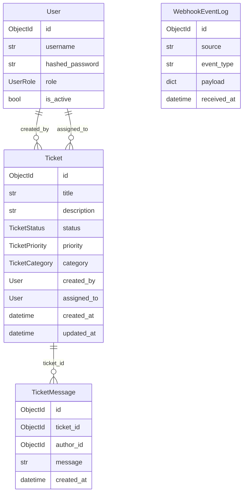
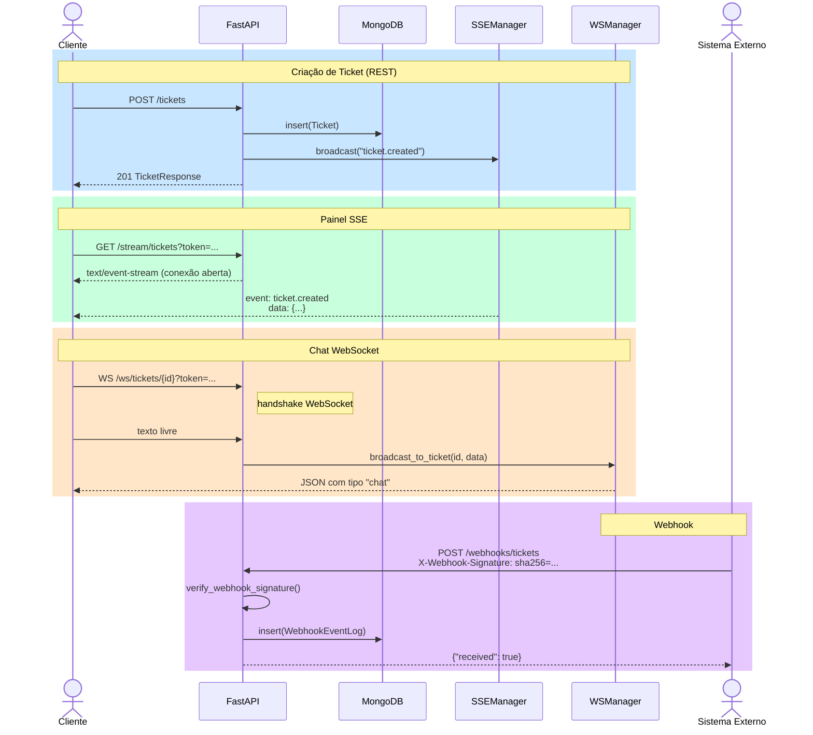
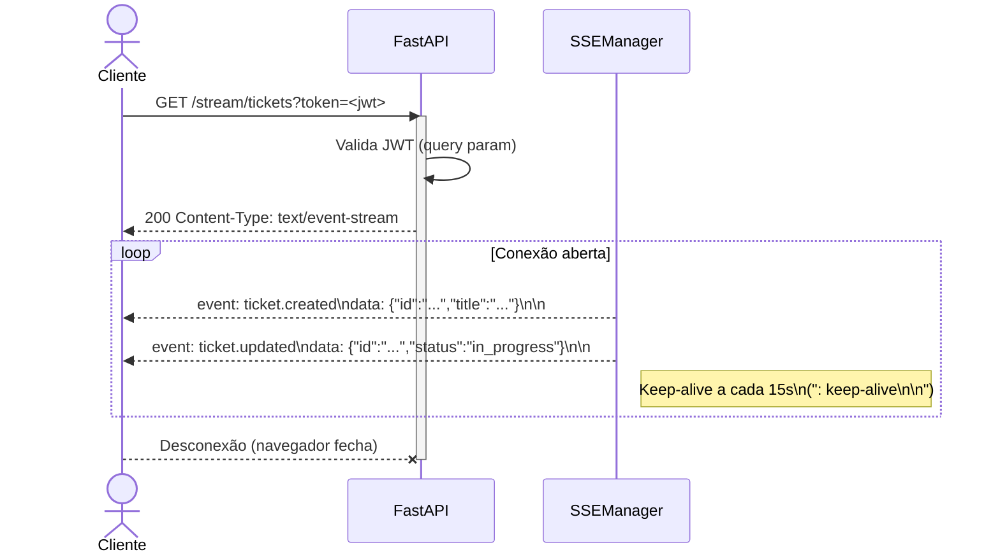
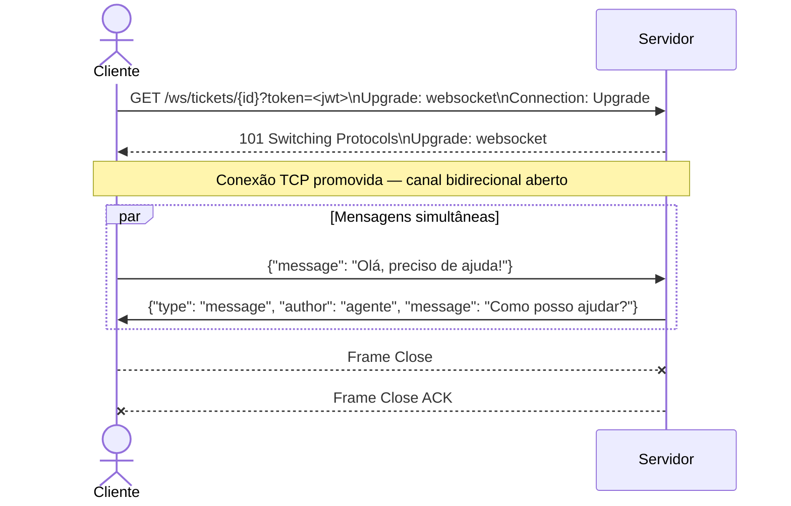
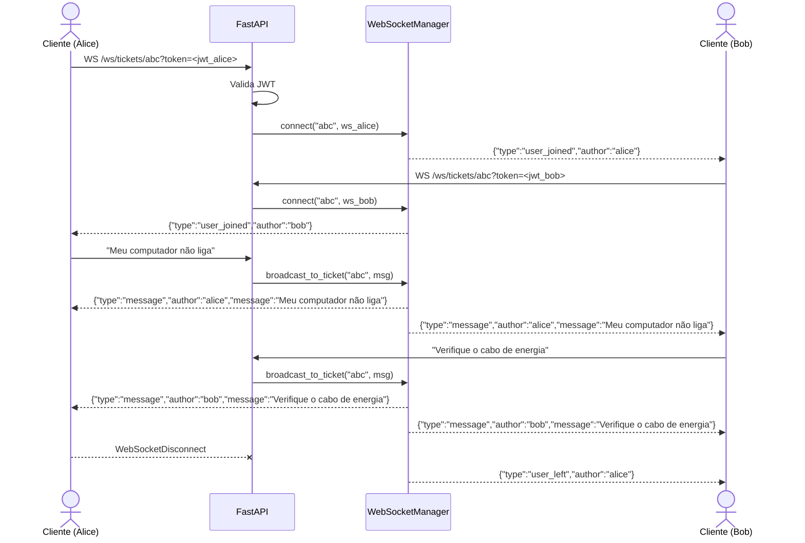
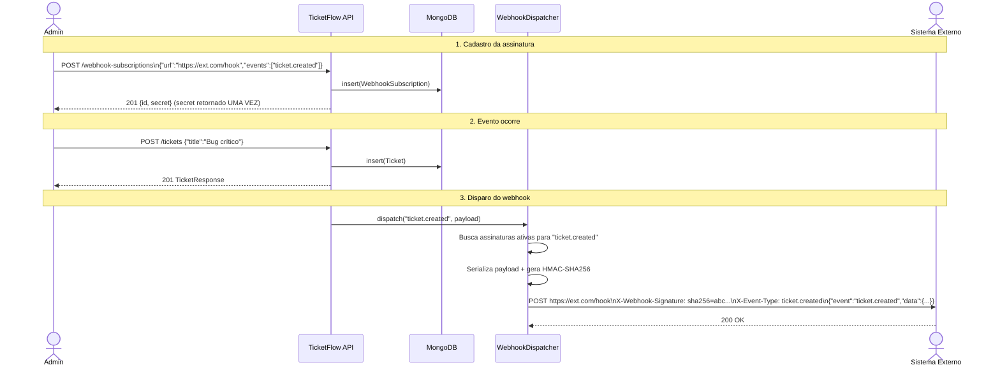

# TicketFlow API Demo

Sistema didático de suporte técnico em tempo real, desenvolvido com **FastAPI**, **Pydantic v2**, **Beanie** e **MongoDB**.

## Visão Geral

O **TicketFlow API Demo** é um projeto pedagógico que demonstra, em um único backend coeso, quatro paradigmas de comunicação distintos:

| Protocolo | Endpoint | Direção | Caso de uso |
|-----------|----------|---------|-------------|
| REST (HTTP) | `/tickets`, `/auth`, `/webhooks` | Bidirecional por requisição | Operações CRUD, autenticação |
| SSE | `/stream/tickets` | Servidor → Cliente | Painel de monitoramento em tempo real |
| WebSocket | `/ws/tickets/{id}` | Bidirecional e persistente | Chat ao vivo por ticket |
| Webhook | `/webhooks/tickets` | Sistema externo → API | Integração com sistemas de terceiros |

---

## Pré-requisitos

- Python 3.11+
- MongoDB (local ou Atlas)

---

## Instalação

```bash
git clone https://github.com/Romario17/TicketFlow-API-Demo.git
cd TicketFlow-API-Demo
python3 -m venv .venv && source .venv/bin/activate
pip install -r requirements.txt
```

Ou, via `pyproject.toml`:

```bash
pip install -e .          # modo desenvolvimento (editable install)
pip install -e ".[dev]"   # modo desenvolvimento + ferramentas (ruff)
```

### Variáveis de ambiente (opcional — `.env`)

Copie o template e ajuste os valores:

```bash
cp .env.template .env
```

```env
MONGODB_URL=mongodb://localhost:27017
MONGODB_DB_NAME=ticketflow
SECRET_KEY=CHANGE_THIS_SECRET_IN_PRODUCTION
WEBHOOK_SECRET=CHANGE_THIS_WEBHOOK_SECRET
ACCESS_TOKEN_EXPIRE_MINUTES=60
```

---

## Execução

### Local

```bash
uvicorn app.main:app --reload
```

### Docker

```bash
cp .env.template .env   # edite os valores conforme necessário
docker compose up --build
```

Acesse o cliente de demonstração em: **http://localhost:8000**

Documentação interativa (Swagger UI): **http://localhost:8000/docs**

### Testes

Os testes unitários utilizam `unittest` e validam os componentes de comunicação em tempo real (SSE, WebSocket e Webhook) de forma isolada, sem dependência de banco de dados ou servidor:

```bash
PYTHONPATH=. python -m unittest discover -s tests -v
```

---

## Estrutura do Projeto

```
app/
├── main.py                    # Ponto de entrada FastAPI
├── core/
│   ├── config.py              # Configurações (pydantic-settings)
│   ├── database.py            # Inicialização Beanie/Motor
│   ├── security.py            # JWT e bcrypt
│   ├── sse.py                 # Gerenciador SSE (asyncio.Queue)
│   └── websocket_manager.py   # Gerenciador WebSocket por ticket
├── models/
│   ├── user.py                # Documento Beanie: User
│   ├── ticket.py              # Documento Beanie: Ticket + Enums
│   ├── ticket_message.py      # Documento Beanie: TicketMessage
│   └── webhook_event.py       # Documento Beanie: WebhookEventLog
├── schemas/
│   ├── auth.py                # Schemas Pydantic: Auth
│   ├── ticket.py              # Schemas Pydantic: Ticket
│   ├── ticket_message.py      # Schemas Pydantic: Message
│   └── webhook.py             # Schemas Pydantic: Webhook
├── routers/
│   ├── auth.py                # POST /auth/register, /auth/login, GET /auth/me
│   ├── tickets.py             # CRUD de tickets
│   ├── messages.py            # Mensagens por ticket
│   ├── stream.py              # GET /stream/tickets (SSE)
│   ├── ws.py                  # WS /ws/tickets/{id}
│   └── webhooks.py            # POST /webhooks/tickets
├── dependencies/
│   └── auth.py                # Dependências FastAPI: get_current_user, require_roles
├── services/
│   ├── auth_service.py        # Lógica de autenticação
│   ├── ticket_service.py      # Lógica de tickets + notificações SSE
│   ├── webhook_service.py     # Validação HMAC e persistência de eventos
│   └── stream_service.py      # Gerador SSE
└── static/
    └── index.html             # Cliente HTML/JS de demonstração
```

---

## Contratos de API

### Autenticação

| Método | Rota | Descrição |
|--------|------|-----------|
| POST | `/auth/register` | Cria usuário (`customer`, `agent`, `manager`) |
| POST | `/auth/login` | Autentica e retorna JWT |
| GET | `/auth/me` | Retorna perfil do usuário autenticado |

### Tickets

| Método | Rota | Papel requerido |
|--------|------|-----------------|
| POST | `/tickets` | Qualquer usuário autenticado |
| GET | `/tickets` | Qualquer usuário autenticado |
| GET | `/tickets/{id}` | Qualquer usuário autenticado |
| PATCH | `/tickets/{id}/status` | `agent` ou `manager` |
| PATCH | `/tickets/{id}/assign` | `manager` |

### Mensagens

| Método | Rota | Descrição |
|--------|------|-----------|
| POST | `/tickets/{id}/messages` | Envia mensagem REST (também notifica via WebSocket) |
| GET | `/tickets/{id}/messages` | Lista mensagens do ticket |

### Stream e WebSocket

| Protocolo | Rota | Autenticação |
|-----------|------|--------------|
| SSE | `GET /stream/tickets?token=<jwt>` | Query param (EventSource não suporta headers) |
| WebSocket | `WS /ws/tickets/{id}?token=<jwt>` | Query param (RFC 6455) |

### Webhook

| Método | Rota | Cabeçalho |
|--------|------|-----------|
| POST | `/webhooks/tickets` | `X-Webhook-Signature: sha256=<hmac>` |

---

## Modelo de Domínio



---

## Fluxo de Comunicação



---

## Conceitos: Server-Sent Events (SSE)

**Server-Sent Events (SSE)** é um mecanismo padronizado pela W3C/WHATWG que permite ao servidor enviar atualizações **unidirecionais** para o cliente por meio de uma conexão HTTP de longa duração. Diferentemente do polling tradicional — onde o cliente envia requisições repetidas perguntando "há novidades?" — com SSE o servidor mantém a conexão aberta e envia dados assim que eles estão disponíveis.

### Características principais

| Característica | Detalhe |
|----------------|---------|
| **Direção** | Unidirecional: servidor → cliente |
| **Protocolo** | HTTP/1.1 (ou HTTP/2) convencional |
| **Formato** | Texto puro (`text/event-stream`) com campos `event:`, `data:`, `id:`, `retry:` |
| **Reconexão** | Automática — o navegador reconecta com o último `id` recebido |
| **API no navegador** | `EventSource` (nativa, sem bibliotecas extras) |

### Quando usar SSE

- **Painéis de monitoramento** que precisam refletir mudanças em tempo real.
- **Feeds de notificações** onde o cliente apenas *recebe* informação.
- Cenários em que **simplicidade** é prioridade, pois SSE funciona sobre HTTP comum (sem upgrade de protocolo) e atravessa proxies e firewalls com facilidade.

### Quando *não* usar SSE

- Quando o cliente também precisa enviar dados ao servidor simultaneamente (prefira WebSocket).
- Quando a latência abaixo de milissegundos é crítica (ex.: jogos multiplayer).

### Como funciona no TicketFlow



### Implementação no projeto

O `SSEManager` (`app/core/sse.py`) utiliza uma **fila `asyncio.Queue` por cliente** para desacoplar os produtores de eventos (serviços de domínio) dos consumidores (streams SSE). Quando um ticket é criado ou alterado, o `TicketService` chama `sse_manager.broadcast(event_type, data)`, que coloca a mensagem formatada em todas as filas ativas. Cada cliente conectado consome sua fila via um **gerador assíncrono** que também emite um comentário keep-alive a cada 15 segundos para evitar que proxies intermediários encerrem a conexão por inatividade.

---

## Conceitos: WebSocket

**WebSocket** (RFC 6455) é um protocolo de comunicação **bidirecional e full-duplex** que opera sobre uma única conexão TCP persistente. Ao contrário do HTTP tradicional (requisição-resposta), o WebSocket permite que **tanto o servidor quanto o cliente enviem mensagens a qualquer momento**, sem que um precise esperar pelo outro.

### Como a conexão é estabelecida

A conexão WebSocket começa como uma requisição HTTP convencional com um cabeçalho `Upgrade: websocket`. Se o servidor aceita, ocorre o **handshake** e a conexão é "promovida" de HTTP para WebSocket. A partir desse ponto, o canal TCP permanece aberto e ambos os lados podem transmitir frames de dados de forma independente.



### Características principais

| Característica | Detalhe |
|----------------|---------|
| **Direção** | Bidirecional (full-duplex) |
| **Protocolo** | `ws://` ou `wss://` (TLS) após upgrade HTTP |
| **Formato de dados** | Frames binários ou texto — sem restrição de formato |
| **Latência** | Muito baixa — sem overhead de cabeçalhos HTTP por mensagem |
| **Reconexão** | Não automática — o cliente deve implementar lógica de reconexão |

### Quando usar WebSocket

- **Chat em tempo real** entre usuários (como o chat por ticket do TicketFlow).
- **Colaboração ao vivo** (edição simultânea de documentos, quadros brancos).
- **Jogos multiplayer** onde latência mínima é essencial.
- Cenários em que **ambas as partes** precisam enviar dados a qualquer momento.

### Quando *não* usar WebSocket

- Quando apenas o servidor envia dados (prefira SSE — mais simples).
- Quando a comunicação é esporádica e do tipo requisição-resposta (prefira REST).

### Como funciona no TicketFlow



### Implementação no projeto

O `WebSocketManager` (`app/core/websocket_manager.py`) agrupa conexões WebSocket ativas por `ticket_id` usando um `defaultdict(list)`. Quando uma mensagem é enviada por um participante, o manager itera sobre todas as conexões do ticket e envia o JSON via `send_text()`. Conexões "mortas" (que falharam ao enviar) são removidas silenciosamente, garantindo robustez. A autenticação ocorre via query parameter `token` porque o protocolo WebSocket no navegador não suporta envio de cabeçalhos HTTP personalizados durante o handshake (limitação da API `WebSocket` do JavaScript).

### Diferença entre SSE e WebSocket

| Aspecto | SSE | WebSocket |
|---------|-----|-----------|
| Direção | Servidor → Cliente | Bidirecional |
| Protocolo | HTTP padrão | Protocolo próprio (upgrade) |
| Reconexão | Automática (`EventSource`) | Manual |
| Overhead | Baixo (HTTP) | Muito baixo (frames binários) |
| Proxy/firewall | Transparente | Pode exigir configuração |
| Caso de uso típico | Dashboards, notificações | Chat, jogos, colaboração |

---

## Conceitos: Webhook

**Webhook** é um padrão de integração baseado em **callbacks HTTP**: em vez de o sistema consumidor fazer polling para verificar se algo mudou, o sistema produtor envia uma requisição HTTP POST automaticamente para uma URL previamente cadastrada, assim que o evento ocorre. É frequentemente descrito como "HTTP push" ou "reverse API".

### Como funciona

1. O sistema consumidor **cadastra uma URL** (endpoint de callback) junto ao sistema produtor, informando quais eventos deseja receber.
2. Quando um evento relevante ocorre, o produtor **serializa o payload** em JSON e **dispara um POST** para a URL cadastrada.
3. O consumidor **recebe o POST**, valida a autenticidade (ex.: via HMAC) e processa o evento.

### Características principais

| Característica | Detalhe |
|----------------|---------|
| **Direção** | Produtor → Consumidor (push) |
| **Protocolo** | HTTP convencional (POST) |
| **Acoplamento** | Fraco — produtor e consumidor se comunicam apenas via contrato HTTP |
| **Autenticação** | Normalmente via assinatura HMAC no cabeçalho da requisição |
| **Confiabilidade** | Depende de retry, dead-letter queue e idempotência |

### Quando usar Webhook

- **Integração entre sistemas** — notificar um CRM, sistema de e-mail, ou serviço de analytics quando algo acontece.
- **Pipelines de CI/CD** — disparar builds quando um commit é pushado (ex.: GitHub Webhooks).
- **Processamento assíncrono** — delegar tarefas a serviços externos sem bloquear a resposta ao cliente.

### Quando *não* usar Webhook

- Quando o consumidor é um navegador (prefira SSE ou WebSocket — navegadores não expõem endpoints HTTP).
- Quando a entrega precisa ser garantida em tempo real com baixa latência (prefira fila de mensagens como RabbitMQ/Kafka).

### Como funciona no TicketFlow



### Segurança de webhooks: HMAC-SHA256

Para que o consumidor possa verificar que a requisição veio realmente do TicketFlow (e não de um atacante), cada entrega é assinada:

1. O produtor gera um `secret` único por assinatura (ex.: `secrets.token_hex(32)`).
2. Ao enviar, calcula `HMAC-SHA256(payload, secret)` e inclui no cabeçalho `X-Webhook-Signature: sha256=<hex>`.
3. O consumidor recalcula o HMAC com o mesmo secret e compara com `hmac.compare_digest()` para evitar timing attacks.

### Implementação no projeto

O `WebhookDispatcherService` (`app/services/webhook_dispatcher.py`) é responsável por despachar os eventos. Quando o `TicketService` notifica que um ticket foi criado ou alterado, o dispatcher consulta o repositório por assinaturas ativas que cobrem o tipo de evento, serializa o payload com timestamp, calcula a assinatura HMAC-SHA256 e dispara as entregas em paralelo via `asyncio.create_task()`. Falhas na entrega são logadas mas não bloqueiam o fluxo principal — em produção, recomenda-se substituir por uma fila de mensagens com retry e dead-letter queue.

---

## Segurança

- **JWT**: tokens assinados com HMAC-SHA256 (HS256) via `python-jose`.
- **Senhas**: armazenadas com hash bcrypt via `passlib`.
- **Webhook**: assinatura HMAC-SHA256 comparada com `hmac.compare_digest` (resistente a timing attacks).
- **Autorização por papel**: `require_roles()` injeta verificação declarativa nos endpoints.

> **Simplificação didática**: em produção, o `SECRET_KEY` e o `WEBHOOK_SECRET` devem ser gerados com entropia adequada e armazenados em vault de segredos — nunca em código-fonte ou `.env` versionado.

---

## Tecnologias

| Tecnologia | Versão | Papel |
|-----------|--------|-------|
| FastAPI | 0.135.1 | Framework web assíncrono |
| Pydantic v2 | 2.11.1 | Validação e serialização de dados |
| Beanie | 2.0.1 | ODM assíncrono para MongoDB |
| python-jose | 3.4.0 | Geração e validação de JWT |
| pwdlib / argon2 | 0.3.0 | Hash de senhas |
| Uvicorn | 0.34.0 | Servidor ASGI |

---

## Referências

- [REST API Design Best Practices](https://restfulapi.net/)
- [HTTP Methods — MDN](https://developer.mozilla.org/pt-BR/docs/Web/HTTP/Methods)
- [FastAPI — Documentação oficial](https://fastapi.tiangolo.com)
- [Pydantic v2 — Documentação oficial](https://docs.pydantic.dev/latest/)
- [python-jose — Documentação](https://python-jose.readthedocs.io)
- [Beanie — Documentação oficial](https://beanie-odm.dev)
- [pymongo — Documentação oficial](https://pymongo.readthedocs.io)
- [MDN — EventSource (SSE)](https://developer.mozilla.org/en-US/docs/Web/API/EventSource)
- [MDN — WebSocket API](https://developer.mozilla.org/en-US/docs/Web/API/WebSocket)
- [RFC 6455 — The WebSocket Protocol](https://datatracker.ietf.org/doc/html/rfc6455)
