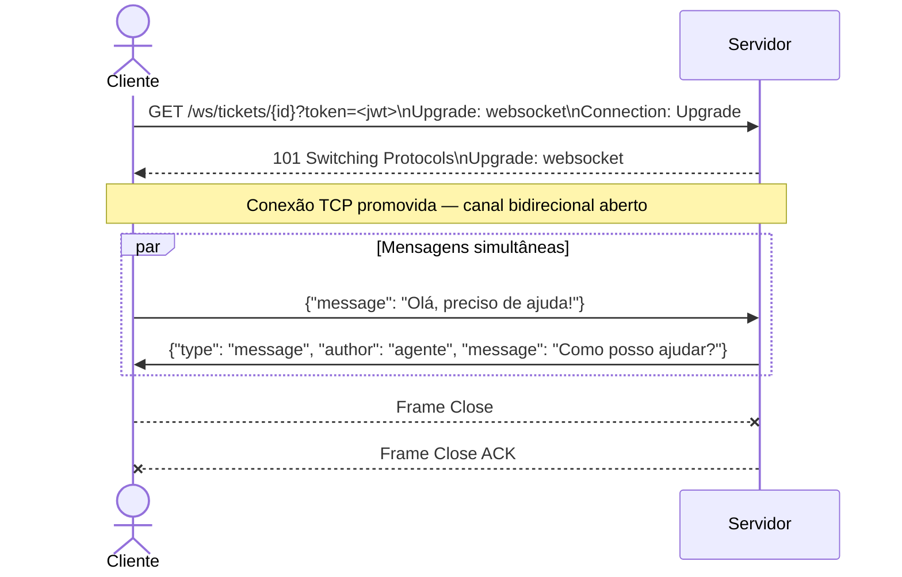

# 🚀 Oficina: APIs com FastAPI

> **Nível**: Básico → Intermediário
>
> **Repositório**: https://github.com/Romario17/api-tutorial

---

## 📋 Sumário

| #   | Tópico                           |
| --- | -------------------------------- |
| 1   | O que é uma API? REST e HTTP     |
| 2   | FastAPI — Primeiros passos       |
| 3   | Modelos e validação com Pydantic |
| 4   | Documentação automática          |
| 5   | Injeção de dependência           |
| 6   | CRUD completo com banco de dados |
| 7   | WebSockets                       |
| 8   | Server-Sent Events (SSE) e MCP   |
| 9   | Webhooks                         |

---

## Parte 1 — O que é uma API?

**API** (_Application Programming Interface_) é um contrato que define como sistemas se comunicam.

```
Cliente (navegador, app, outro serviço)
        │
        │  HTTP Request  (GET /produtos)
        ▼
   [ API Server ]
        │
        │  HTTP Response (JSON)
        ▼
   {"id": 1, "nome": "Notebook", "preco": 3500.00}
```

### REST — Representational State Transfer

Estilo arquitetural mais usado para APIs web. Princípios principais:

| Princípio          | Descrição                                               |
| ------------------ | ------------------------------------------------------- |
| **Stateless**      | Cada requisição contém todas as informações necessárias |
| **Recursos**       | Dados modelados como recursos identificados por URLs    |
| **Verbos HTTP**    | Ações expressas pelos métodos HTTP                      |
| **Representações** | Recursos transferidos em JSON, XML, etc.                |

### Verbos HTTP (os mais usados)

| Método   | Ação        | Exemplo                           |
| -------- | ----------- | --------------------------------- |
| `GET`    | Leitura     | `GET /items` — lista todos        |
| `POST`   | Criação     | `POST /items` — cria novo         |
| `PUT`    | Atualização | `PUT /items/1` — atualiza item 1  |
| `DELETE` | Remoção     | `DELETE /items/1` — remove item 1 |

### Códigos de Status HTTP

| Faixa | Significado      | Exemplos                                                       |
| ----- | ---------------- | -------------------------------------------------------------- |
| `2xx` | Sucesso          | `200 OK`, `201 Created`, `204 No Content`                      |
| `4xx` | Erro do cliente  | `400 Bad Request`, `404 Not Found`, `422 Unprocessable Entity` |
| `5xx` | Erro do servidor | `500 Internal Server Error`                                    |

---

### 🎯 Quiz 1

> Qual método HTTP você usaria para **atualizar o e-mail** de um usuário cadastrado?
>
> a) `GET` b) `POST` c) `PUT` d) `DELETE`

<details><summary>Ver resposta</summary>

**c) `PUT`** — usado para atualizar um recurso existente.
Também é comum usar `PATCH` para atualizações parciais (apenas alguns campos).

</details>

---

## Parte 2 — FastAPI: Primeiros Passos

### Por que FastAPI?

| Característica              | Detalhe                                                    |
| --------------------------- | ---------------------------------------------------------- |
| **Alta performance**        | Baseado em Starlette e ASGI; comparável a Node.js e Go     |
| **Validação automática**    | Integração nativa com Pydantic                             |
| **Documentação automática** | Swagger UI e ReDoc gerados automaticamente                 |
| **Type hints**              | Usa tipagem do Python 3.10+ para inferir validações e docs |
| **Produção real**           | Usado por Netflix, Microsoft, Uber, etc.                   |

### Instalação

```bash
pip install fastapi[standard]
```

### Sua primeira API em 10 linhas

```python
from fastapi import FastAPI

app = FastAPI(title="Minha Primeira API")

@app.get("/")
def root():
    return {"mensagem": "Olá, mundo!"}

@app.get("/saudacao")                       # Parâmetro de query
def saudar(nome: str):
    return {"saudacao": f"Olá, {nome}!"}

@app.get("/saudacao/{nome}")                # Parâmetro de URL
def saudar_path(nome: str):
    return {"saudacao": f"Olá, {nome}!"}
```

### Path parameters × Query parameters

- **Path parameter**: parte da URL → `/itens/{item_id}`
- **Query parameter**: após `?` → `/itens?skip=0&limit=10`

```python
from fastapi import FastAPI

app = FastAPI()

produtos_db = [
    {"id": 1, "nome": "Notebook",  "preco": 3500.0},
    {"id": 2, "nome": "Mouse",     "preco": 89.90},
    {"id": 3, "nome": "Teclado",   "preco": 199.0},
]


@app.get("/produtos")  # query params: skip e limit
def listar_produtos(skip: int = 0, limit: int = 10):
    return produtos_db[skip : skip + limit]


@app.get("/produtos/{produto_id}")  # path param: produto_id
def buscar_produto(produto_id: int):
    for p in produtos_db:
        if p["id"] == produto_id:
            return p
    return {"erro": "Produto não encontrado"}, 404


# Testando diretamente com TestClient (sem iniciar servidor)
from fastapi.testclient import TestClient

client = TestClient(app)

print("Todos os produtos:", client.get("/produtos").json())
print("Paginado (skip=1, limit=2):", client.get("/produtos?skip=1&limit=2").json())
print("Produto 2:", client.get("/produtos/2").json())
```

### 🎯 Quiz 2

> Qual URL retorna os produtos do índice 5 ao 9 (5 itens)?
>
> a) `/produtos/5/9`  
> b) `/produtos?skip=5&limit=5`  
> c) `/produtos?start=5&end=9`  
> d) `/produtos/skip/5/limit/5`

<details><summary>Ver resposta</summary>

**b) `/produtos?skip=5&limit=5`** — `skip` pula os 5 primeiros, `limit` retorna 5 itens.

</details>

---

## Parte 3 — Modelos e Validação com Pydantic

Pydantic transforma `dict` em objetos tipados e valida os dados automaticamente.

### Sem Pydantic (problemático)

```python
# Sem validação: qualquer coisa passa
def criar_produto_sem_validacao(dados: dict):
    nome  = dados.get("nome")   # pode ser None, int, qualquer coisa
    preco = dados.get("preco")  # pode ser negativo, string...
    return {"nome": nome, "preco": preco}

print(criar_produto_sem_validacao({"nome": 42, "preco": -100}))
# 😱 Nenhum erro — dados inválidos entram no sistema
```

```python
from pydantic import BaseModel, Field

class Produto(BaseModel):
    nome:     str   = Field(..., min_length=2, max_length=100)
    preco:    float = Field(..., gt=0, description="Deve ser maior que zero")
    em_stock: bool  = True  # valor padrão

# ✅ Dados válidos
p = Produto(nome="Notebook", preco=3500.0)
print(p)
print(p.model_dump())  # converte para dict
```

```python
from pydantic import ValidationError

# ❌ Dados inválidos — Pydantic lança ValidationError
try:
    Produto(nome="", preco=-50)
except ValidationError as e:
    print(e)  # mensagens claras sobre cada campo inválido
```

### Integrando Pydantic no FastAPI

Quando você usa um modelo Pydantic como parâmetro de uma rota `POST`/`PUT`,
o FastAPI automaticamente:

1. Lê o corpo JSON da requisição
2. Valida com Pydantic
3. Retorna `422 Unprocessable Entity` se inválido (com detalhes dos erros)

```python
from fastapi import FastAPI
from fastapi.testclient import TestClient
from pydantic import BaseModel, Field

app3 = FastAPI()

class ProdutoCreate(BaseModel):
    nome:     str   = Field(..., min_length=2)
    preco:    float = Field(..., gt=0)
    em_stock: bool  = True

class ProdutoResponse(ProdutoCreate):
    id: int

_db: list[ProdutoResponse] = []
_counter = 0

@app3.post("/produtos", response_model=ProdutoResponse, status_code=201)
def criar_produto(payload: ProdutoCreate):
    global _counter
    _counter += 1
    produto = ProdutoResponse(id=_counter, **payload.model_dump())
    _db.append(produto)
    return produto

client3 = TestClient(app3)

# ✅ Criação com dados válidos
r = client3.post("/produtos", json={"nome": "Mouse", "preco": 89.90})
print("Status:", r.status_code, "→", r.json())

# ❌ Preço negativo
r_invalido = client3.post("/produtos", json={"nome": "X", "preco": -10})
print("\nStatus inválido:", r_invalido.status_code)
for err in r_invalido.json()["detail"]:
    print(" -", err["loc"], "→", err["msg"])
```

### 🎯 Experimento ao vivo

> **Desafio para um voluntário**: adicione um campo `categoria` (string, obrigatório, mínimo 3 caracteres)
> ao modelo `ProdutoCreate` e verifique o que acontece ao tentar criar um produto sem ele.

---

## Parte 4 — Documentação Automática

Nas seções anteriores você viu que o FastAPI usa type hints e modelos Pydantic para validar dados. Esse mesmo código que valida **também gera documentação interativa automaticamente** — sem escrever uma linha a mais.

### Como acessar

Suba o servidor com:

```bash
uvicorn main:app --reload
```

> `--reload` reinicia o servidor automaticamente a cada mudança no código. Ideal para desenvolvimento.

Acesse no navegador:

| URL                                  | Interface  | Descrição                                             |
| ------------------------------------ | ---------- | ----------------------------------------------------- |
| `http://localhost:8000/docs`         | Swagger UI | Interface interativa — permite testar as rotas direto |
| `http://localhost:8000/redoc`        | ReDoc      | Documentação somente leitura, focada em navegação e referência |
| `http://localhost:8000/openapi.json` | OpenAPI    | Especificação bruta em JSON (base das duas interfaces) |

### Tudo que você já escreveu vira documentação

```
Seu código Python                      O que aparece no /docs
──────────────────────────────────     ────────────────────────────────────
@app.post("/items", status_code=201) → método POST, URL /items, status 201
payload: ItemCreate                  → corpo JSON com schema dos campos
response_model=Item                  → exemplo de resposta com todos os campos
Field(..., gt=0, description="...")  → validações e descrição visíveis no schema
```

Não há duplicação: a fonte da verdade é o código Python.

### Tags, summary e docstrings

Pequenas adições enriquecem bastante o `/docs`:

```python
app = FastAPI(title="API de Produtos", version="1.0.0")

@app.get(
    "/produtos/{produto_id}",
    tags=["Produtos"],               # agrupa rotas no menu lateral
    summary="Busca um produto pelo ID",
    response_description="Dados completos do produto",
)
def buscar_produto(produto_id: int):
    """
    Retorna um único produto a partir do seu identificador único.

    - **produto_id**: inteiro positivo
    - Retorna `404` se o produto não existir
    """
    ...
```

> O docstring da função (entre `"""`) aparece no Swagger como descrição detalhada da rota.

### 🎯 Quiz 3

> Qual afirmação sobre a documentação automática do FastAPI é **incorreta**?
>
> a) O Swagger UI permite testar as rotas diretamente no navegador  
> b) A documentação precisa ser escrita manualmente em um arquivo YAML separado  
> c) As validações do Pydantic aparecem automaticamente no schema  
> d) `/openapi.json` contém a especificação bruta que alimenta o `/docs`

<details><summary>Ver resposta</summary>

**b)** A documentação **não** precisa ser escrita manualmente. O FastAPI gera a especificação OpenAPI automaticamente a partir dos type hints, modelos Pydantic e metadados das rotas.

</details>

---

## Parte 5 — Injeção de Dependência

Nas partes anteriores cada rota foi totalmente independente. Mas em aplicações reais, várias rotas compartilham a mesma lógica: verificar autenticação, validar paginação, abrir conexão com banco. Repetir esse código em cada rota cria duplicação e dificulta manutenção.

**Dependency Injection** resolve isso: você define a lógica uma vez numa função, e o FastAPI a executa automaticamente antes da rota, injetando o resultado.

```
Sem DI                             Com DI
──────────────────────────────     ──────────────────────────────────
@app.get("/usuarios")              def paginacao(skip=0, limit=10):
def listar(skip=0, limit=10):          return {"skip": skip, "limit": limit}
    validar_paginacao(skip, limit)
    ...                            @app.get("/usuarios")
                                   def listar(p = Depends(paginacao)):
@app.get("/produtos")                  ...
def listar(skip=0, limit=10):
    validar_paginacao(skip, limit) @app.get("/produtos")
    ...                            def listar(p = Depends(paginacao)):
                                       ...
```

### Exemplo: paginação compartilhada

```python
from fastapi import FastAPI, Depends, Query

app = FastAPI()

# A dependência é uma função comum — pode ter seus próprios parâmetros
def paginacao(
    skip:  int = Query(0,  ge=0),
    limit: int = Query(10, ge=1, le=100),
):
    return {"skip": skip, "limit": limit}

usuarios_db = ["Alice", "Bob", "Carol", "Dave", "Eve"]
produtos_db = ["Notebook", "Mouse", "Teclado"]

@app.get("/usuarios")
def listar_usuarios(pagina: dict = Depends(paginacao)):
    return usuarios_db[pagina["skip"] : pagina["skip"] + pagina["limit"]]

@app.get("/produtos")
def listar_produtos(pagina: dict = Depends(paginacao)):
    return produtos_db[pagina["skip"] : pagina["skip"] + pagina["limit"]]
```

Mudar as regras de paginação em um único lugar afeta todas as rotas que a usam. O FastAPI também documenta automaticamente os parâmetros da dependência no `/docs` de cada rota.

### Dependências com verificação de acesso

O padrão se torna ainda mais poderoso para autenticação. A dependência verifica o token e retorna o usuário — ou lança `HTTPException` antes da rota ser executada:

```python
from fastapi import Depends, HTTPException, Header

def usuario_autenticado(authorization: str = Header(...)):
    token = authorization.removeprefix("Bearer ")
    usuario = verificar_token(token)   # lógica de validação JWT
    if not usuario:
        raise HTTPException(status_code=401, detail="Token inválido")
    return usuario

@app.get("/perfil")
def perfil(usuario = Depends(usuario_autenticado)):
    return {"nome": usuario.nome}

@app.delete("/conta")
def excluir_conta(usuario = Depends(usuario_autenticado)):
    ...  # usuário já validado, sem repetir código
```

### 🎯 Quiz 4

> O que acontece se uma dependência lançar `HTTPException`?
>
> a) O erro é ignorado e a rota continua executando  
> b) A execução da rota é interrompida e o erro é retornado ao cliente  
> c) A dependência é chamada novamente até ter sucesso  
> d) O FastAPI retorna status `200` com o detalhe do erro no corpo

<details><summary>Ver resposta</summary>

**b)** A `HTTPException` lançada dentro de uma dependência interrompe imediatamente a cadeia e retorna a resposta de erro — a função da rota nunca chega a ser executada.

</details>

---

## Parte 6 — CRUD Completo com Banco de Dados

Com verbos HTTP (Parte 1), parâmetros de rota (Parte 2), modelos Pydantic (Parte 3) e injeção de dependência (Parte 5) em mãos, podemos montar um CRUD completo — desta vez com persistência real usando **Beanie**.

### Por que Beanie?

**Beanie** é um ODM (_Object Document Mapper_) assíncrono para MongoDB. A grande vantagem é que ele usa **Pydantic como base** — os modelos que você já conhece viram documentos no banco sem precisar de um schema separado.

```
Pydantic puro                       Beanie (persiste no MongoDB)
──────────────────────────────      ──────────────────────────────────
class Item(BaseModel):              class Item(Document):
    name: str                           name: str
    price: float                        price: float
                                        class Settings:
# dado só existe em memória                 name = "items"  # coleção
```

### Configuração da conexão com `lifespan`

`lifespan` é um gerenciador de contexto que roda código na **inicialização** e no **encerramento** da aplicação — o lugar certo para abrir e fechar a conexão com o banco:

```python
from beanie import Document, init_beanie
from pymongo import AsyncMongoClient
from contextlib import asynccontextmanager
from fastapi import FastAPI

@asynccontextmanager
async def lifespan(app: FastAPI):
    client = AsyncMongoClient("mongodb://localhost:27017")
    await init_beanie(database=client["meu_db"], document_models=[Item])
    yield          # aplicação fica disponível aqui
    client.close() # executado no encerramento

app = FastAPI(lifespan=lifespan)
```

### Dois modelos para o mesmo recurso

```
ItemCreate  →  o que o cliente ENVIA    (sem ID — o MongoDB gera um ObjectId)
Item        →  o que o servidor RETORNA (com ID — já foi persistido)
```

Separar os modelos impede que o cliente force um ID arbitrário e deixa explícito o contrato de cada rota. Com Beanie, `Item` herda de `Document` e carrega o `id` automaticamente após o `insert`.

### Retornando erros corretamente com `HTTPException`

Na Parte 2, quando um produto não era encontrado, retornávamos um dicionário de erro — mas o status HTTP continuava `200 OK`. `HTTPException` corrige isso: interrompe a rota e envia o status certo:

```python
item = await Item.get(item_id)
if not item:
    raise HTTPException(status_code=404, detail="Item não encontrado")
```

### Código completo

```python
from beanie import Document, PydanticObjectId, init_beanie
from contextlib import asynccontextmanager
from fastapi import FastAPI, HTTPException
from pymongo import AsyncMongoClient
from pydantic import BaseModel, Field

# --- Modelos ---

class Item(Document):
    name:        str         = Field(..., min_length=1, max_length=100)
    description: str | None = None
    price:       float       = Field(..., gt=0)
    in_stock:    bool        = True

    class Settings:
        name = "items"

class ItemCreate(BaseModel):
    name:        str         = Field(..., min_length=1, max_length=100)
    description: str | None = None
    price:       float       = Field(..., gt=0)
    in_stock:    bool        = True

class ItemUpdate(BaseModel):
    name:        str | None   = None
    description: str | None   = None
    price:       float | None = None
    in_stock:    bool | None  = None

# --- Configuração ---

@asynccontextmanager
async def lifespan(app: FastAPI):
    client = AsyncMongoClient("mongodb://localhost:27017")
    await init_beanie(database=client["meu_db"], document_models=[Item])
    yield
    client.close()

app = FastAPI(title="CRUD de Itens", lifespan=lifespan)

# --- Rotas ---

@app.get("/items", response_model=list[Item])
async def list_items():
    return await Item.find_all().to_list()

@app.get("/items/{item_id}", response_model=Item)
async def get_item(item_id: PydanticObjectId):
    item = await Item.get(item_id)
    if not item:
        raise HTTPException(status_code=404, detail="Item não encontrado")
    return item

@app.post("/items", response_model=Item, status_code=201)
async def create_item(payload: ItemCreate):
    item = Item(**payload.model_dump())
    await item.insert()
    return item

@app.put("/items/{item_id}", response_model=Item)
async def update_item(item_id: PydanticObjectId, payload: ItemUpdate):
    item = await Item.get(item_id)
    if not item:
        raise HTTPException(status_code=404, detail="Item não encontrado")
    updates = {k: v for k, v in payload.model_dump().items() if v is not None}
    await item.set(updates)
    return item

@app.delete("/items/{item_id}", status_code=204)
async def delete_item(item_id: PydanticObjectId):
    item = await Item.get(item_id)
    if not item:
        raise HTTPException(status_code=404, detail="Item não encontrado")
    await item.delete()
```

> Todas as rotas são `async def` porque operações de banco são I/O — o servidor não precisa ficar bloqueado esperando a resposta do MongoDB.

### 🎯 Quiz 5

> A rota `DELETE /items/{item_id}` retorna status `204`. Por que não retorna `200`?
>
> a) Porque `204` significa "proibido"  
> b) Porque `204` significa "sem conteúdo" — correto para DELETE, que não tem corpo de resposta  
> c) Porque o item não foi encontrado  
> d) É um bug — deveria retornar `200`

<details><summary>Ver resposta</summary>

**b)** `204 No Content` indica sucesso sem corpo de resposta. É a convenção REST para operações de deleção.

</details>

---

## Parte 7 — WebSockets

Até agora toda comunicação seguiu o modelo **requisição → resposta**: o cliente pergunta, o servidor responde, a conexão é encerrada. Isso funciona bem para a maioria dos casos — mas não para situações que exigem atualizações em tempo real.

### O problema do modelo HTTP clássico

```
HTTP tradicional (polling)                 WebSocket
──────────────────────────────────         ──────────────────────────────────
Cliente: "há mensagens novas?"             Cliente ←──────────── Servidor
Servidor: "não"                                     conexão aberta
Cliente: "há mensagens novas?"                      (bidirecional)
Servidor: "não"                            Servidor envia mensagem quando quiser
Cliente: "há mensagens novas?"             Cliente envia mensagem quando quiser
Servidor: "sim! aqui está"
```

O polling gera tráfego desnecessário e atraso. O WebSocket mantém uma **conexão persistente e bidirecional** — servidor e cliente podem se enviar mensagens a qualquer momento.

### Casos de uso típicos

- **Chat em tempo real** entre usuários (como o chat por ticket do TicketFlow).
- **Colaboração ao vivo** (edição simultânea de documentos, quadros brancos).
- **Jogos multiplayer** onde latência mínima é essencial.
- **Dashboards ao vivo** (monitoramento, métricas, leilões, bolsa).
- Cenários em que **ambas as partes** precisam enviar dados a qualquer momento.

### O que é WebSocket? (RFC 6455)

**WebSocket** (RFC 6455) é um protocolo de comunicação **bidirecional e full-duplex** que opera sobre uma única conexão TCP persistente. Ao contrário do HTTP tradicional (requisição-resposta), o WebSocket permite que **tanto o servidor quanto o cliente enviem mensagens a qualquer momento**, sem que um precise esperar pelo outro.

### Como a conexão é estabelecida

A conexão WebSocket começa como uma requisição HTTP convencional com um cabeçalho `Upgrade: websocket`. Se o servidor aceita, ocorre o **handshake** e a conexão é "promovida" de HTTP para WebSocket. A partir desse ponto, o canal TCP permanece aberto e ambos os lados podem transmitir frames de dados de forma independente.



### Características principais

| Característica | Detalhe |
|----------------|---------|
| **Direção** | Bidirecional (full-duplex) |
| **Protocolo** | `ws://` ou `wss://` (TLS) após upgrade HTTP |
| **Formato de dados** | Frames binários ou texto — sem restrição de formato |
| **Latência** | Muito baixa — sem overhead de cabeçalhos HTTP por mensagem |
| **Reconexão** | Não automática — o cliente deve implementar lógica de reconexão |

### Quando *não* usar WebSocket

- Quando apenas o servidor envia dados (prefira SSE — mais simples).
- Quando a comunicação é esporádica e do tipo requisição-resposta (prefira REST).

### WebSocket no FastAPI

O FastAPI suporta WebSockets nativamente. Rotas WebSocket são sempre `async def` — a conexão precisa aguardar eventos sem bloquear o servidor:

```python
from fastapi import FastAPI, WebSocket, WebSocketDisconnect

app = FastAPI()

@app.websocket("/ws/chat")
async def chat(websocket: WebSocket):
    await websocket.accept()           # aceita a conexão
    try:
        while True:
            msg = await websocket.receive_text()     # aguarda mensagem do cliente
            await websocket.send_text(f"Eco: {msg}") # responde
    except WebSocketDisconnect:
        print("Cliente desconectou")   # conexão encerrada normalmente
```

### Gerenciando múltiplos clientes conectados

Na prática, você precisa de um gerenciador que rastreie quem está conectado e distribua mensagens para todos (broadcast):

```python
class GerenciadorDeConexoes:
    def __init__(self):
        self.ativas: list[WebSocket] = []

    async def conectar(self, ws: WebSocket):
        await ws.accept()
        self.ativas.append(ws)

    def desconectar(self, ws: WebSocket):
        self.ativas.remove(ws)

    async def broadcast(self, mensagem: str):
        for ws in self.ativas:
            await ws.send_text(mensagem)

gerenciador = GerenciadorDeConexoes()

@app.websocket("/ws/sala")
async def sala(websocket: WebSocket):
    await gerenciador.conectar(websocket)
    try:
        while True:
            msg = await websocket.receive_text()
            await gerenciador.broadcast(f"Usuário disse: {msg}")
    except WebSocketDisconnect:
        gerenciador.desconectar(websocket)
        await gerenciador.broadcast("Um usuário saiu da sala.")
```

### No lado do cliente (JavaScript)

```javascript
const ws = new WebSocket("ws://localhost:8000/ws/sala");

ws.onopen    = ()    => ws.send("Olá a todos!");
ws.onmessage = (evt) => console.log("Recebido:", evt.data);
ws.onclose   = ()    => console.log("Conexão encerrada");
```

### 🎯 Quiz 6

> Qual afirmação descreve melhor a diferença entre HTTP e WebSocket?
>
> a) WebSocket só funciona com métodos GET  
> b) HTTP mantém a conexão aberta; WebSocket abre e fecha a cada mensagem  
> c) WebSocket permite comunicação bidirecional contínua; HTTP fecha a conexão após cada resposta  
> d) São idênticos — WebSocket é apenas um nome mais moderno para HTTP

<details><summary>Ver resposta</summary>

**c)** WebSocket estabelece uma conexão persistente e bidirecional. No HTTP clássico, cada ciclo requisição–resposta encerra a conexão (ou a reutiliza via keep-alive, mas ainda é unidirecional por requisição).

</details>

---

## Parte 8 — Server-Sent Events (SSE)

Nas partes anteriores vimos REST (requisição–resposta) e WebSocket (bidirecional persistente). Mas há cenários em que apenas o **servidor** precisa enviar dados ao cliente — sem que o cliente precise responder. Para isso existe o **SSE**.

### O que é SSE?

**Server-Sent Events (SSE)** é um mecanismo padronizado pela W3C/WHATWG que permite ao servidor enviar atualizações **unidirecionais** para o cliente por meio de uma conexão HTTP de longa duração. Diferentemente do polling tradicional — onde o cliente envia requisições repetidas perguntando "há novidades?" — com SSE o servidor mantém a conexão aberta e envia dados assim que eles estão disponíveis.

```
Polling tradicional                       SSE
──────────────────────────────────        ──────────────────────────────────
Cliente: "novidades?"  → Servidor         Cliente ←────────── Servidor
Servidor: "não"                                   conexão HTTP aberta
Cliente: "novidades?"  → Servidor         Servidor envia dados quando quiser
Servidor: "não"                           Cliente apenas recebe
Cliente: "novidades?"  → Servidor
Servidor: "sim! aqui está"
```

### Características principais

| Característica | Detalhe |
|----------------|---------|
| **Direção** | Unidirecional: servidor → cliente |
| **Protocolo** | HTTP/1.1 (ou HTTP/2) convencional |
| **Formato** | Texto puro (`text/event-stream`) com campos `event:`, `data:`, `id:`, `retry:` |
| **Reconexão** | Automática — o navegador reconecta com o último `id` recebido |
| **API no navegador** | `EventSource` (nativa, sem bibliotecas extras) |

### Quando usar SSE

- **Painéis de monitoramento** que precisam refletir mudanças em tempo real.
- **Feeds de notificações** onde o cliente apenas *recebe* informação.
- **Servidores MCP** que precisam enviar respostas e notificações a assistentes de IA via stream HTTP.
- Cenários em que **simplicidade** é prioridade, pois SSE funciona sobre HTTP comum (sem upgrade de protocolo) e atravessa proxies e firewalls com facilidade.

### Quando *não* usar SSE

- Quando o cliente também precisa enviar dados ao servidor simultaneamente (prefira WebSocket).
- Quando a latência abaixo de milissegundos é crítica (ex.: jogos multiplayer).

### SSE no FastAPI

O FastAPI suporta SSE por meio do `StreamingResponse` — basta retornar um **gerador assíncrono** que produz strings no formato `text/event-stream`:

```python
import asyncio
from fastapi import FastAPI
from fastapi.responses import StreamingResponse

app = FastAPI()

async def gerador_eventos():
    """Gera eventos SSE a cada 2 segundos."""
    contador = 0
    while True:
        contador += 1
        # Formato SSE: cada bloco termina com \n\n
        yield f"event: atualização\ndata: {{\"contador\": {contador}}}\n\n"
        await asyncio.sleep(2)

@app.get("/stream/eventos")
async def stream():
    return StreamingResponse(
        gerador_eventos(),
        media_type="text/event-stream",
        headers={"Cache-Control": "no-cache"},
    )
```

### No lado do cliente (JavaScript)

```javascript
const source = new EventSource("http://localhost:8000/stream/eventos");

source.addEventListener("atualização", (event) => {
    const dados = JSON.parse(event.data);
    console.log("Contador:", dados.contador);
});

source.onerror = () => console.log("Conexão perdida — reconectando automaticamente...");
// O EventSource reconecta automaticamente!
```

### SSE no contexto de MCP (Model Context Protocol)

O **Model Context Protocol (MCP)** é um protocolo aberto que padroniza a comunicação entre assistentes de IA (como o GitHub Copilot e o Claude) e **servidores de ferramentas externas** — bancos de dados, APIs, sistemas de arquivos, etc. O MCP utiliza SSE como um de seus mecanismos de transporte, aproveitando exatamente as mesmas características que vimos nesta seção.

#### Como o MCP usa SSE

No transporte **Streamable HTTP** do MCP, a comunicação funciona assim:

1. O **cliente MCP** (assistente de IA) envia requisições via `HTTP POST` para o servidor MCP.
2. O **servidor MCP** responde via **SSE**, enviando resultados e notificações em tempo real pelo stream `text/event-stream`.
3. O servidor pode manter a conexão SSE aberta para enviar **notificações assíncronas** (ex.: progresso de tarefas longas, atualizações de recursos).

```
MCP Client (IA)                         MCP Server (Ferramentas)
───────────────                         ────────────────────────
    │                                        │
    │  POST /mcp (JSON-RPC)                  │
    │  {"method":"tools/call",               │
    │   "params":{"name":"query_db"}}        │
    │ ─────────────────────────────────────►  │
    │                                        │
    │  Content-Type: text/event-stream       │
    │  ◄─────────────────────────────────────│
    │  event: message                        │
    │  data: {"result":{"rows":[...]}}       │
    │                                        │
    │  (conexão SSE mantida para             │
    │   notificações futuras)                │
```

#### Por que SSE é ideal para MCP

| Vantagem do SSE | Benefício para MCP |
|-----------------|---------------------|
| **HTTP padrão** | Funciona com infraestrutura existente (proxies, load balancers, firewalls) |
| **Unidirecional** | Modelo natural para respostas do servidor — o cliente envia via POST separado |
| **Reconexão automática** | Sessões MCP sobrevivem a quedas temporárias de rede |
| **Streaming nativo** | Permite respostas incrementais (ex.: resultados parciais de queries longas) |
| **Simplicidade** | Mais fácil de implementar e depurar do que WebSocket para cenários requisição-resposta |

### Diferença entre SSE e WebSocket

| Aspecto | SSE | WebSocket |
|---------|-----|-----------|
| Direção | Servidor → Cliente | Bidirecional |
| Protocolo | HTTP padrão | Protocolo próprio (upgrade) |
| Reconexão | Automática (`EventSource`) | Manual |
| Overhead | Baixo (HTTP) | Muito baixo (frames binários) |
| Proxy/firewall | Transparente | Pode exigir configuração |
| Caso de uso típico | Dashboards, notificações, MCP | Chat, jogos, colaboração |

### 🎯 Quiz 7

> Qual das alternativas descreve **corretamente** o SSE?
>
> a) SSE permite comunicação bidirecional entre cliente e servidor  
> b) O navegador precisa de uma biblioteca JavaScript extra para usar SSE  
> c) SSE mantém uma conexão HTTP aberta e o servidor envia eventos quando disponíveis  
> d) SSE exige um upgrade de protocolo igual ao WebSocket

<details><summary>Ver resposta</summary>

**c)** SSE usa HTTP convencional — o servidor mantém a conexão aberta e envia dados no formato `text/event-stream`. A API `EventSource` é nativa no navegador (sem bibliotecas extras) e reconecta automaticamente.

</details>

---

## Parte 9 — Webhooks

WebSocket e SSE resolvem comunicação em tempo real com o **navegador**. Mas e quando o destino é outro **servidor** — um CRM, um sistema de e-mail, ou um pipeline de CI/CD? Para isso existe o **Webhook**.

### O que é um Webhook?

**Webhook** é um padrão de integração baseado em **callbacks HTTP**: em vez de o sistema consumidor fazer polling para verificar se algo mudou, o sistema produtor envia uma requisição HTTP POST automaticamente para uma URL previamente cadastrada, assim que o evento ocorre. É frequentemente descrito como "HTTP push" ou "reverse API".

```
Polling (consumidor pergunta)              Webhook (produtor avisa)
──────────────────────────────────         ──────────────────────────────────
Consumidor: "houve mudança?"               Produtor detecta evento
Produtor: "não"                            Produtor: POST https://consumidor/hook
Consumidor: "houve mudança?"                         {"event": "ticket.created", ...}
Produtor: "não"                            Consumidor processa o evento
Consumidor: "houve mudança?"
Produtor: "sim!" (mas já passou tempo)
```

### Como funciona

1. O sistema consumidor **cadastra uma URL** (endpoint de callback) junto ao sistema produtor, informando quais eventos deseja receber.
2. Quando um evento relevante ocorre, o produtor **serializa o payload** em JSON e **dispara um POST** para a URL cadastrada.
3. O consumidor **recebe o POST**, valida a autenticidade (ex.: via HMAC) e processa o evento.

### Características principais

| Característica | Detalhe |
|----------------|---------|
| **Direção** | Produtor → Consumidor (push) |
| **Protocolo** | HTTP convencional (POST) |
| **Acoplamento** | Fraco — produtor e consumidor se comunicam apenas via contrato HTTP |
| **Autenticação** | Normalmente via assinatura HMAC no cabeçalho da requisição |
| **Confiabilidade** | Depende de retry, dead-letter queue e idempotência |

### Quando usar Webhook

- **Integração entre sistemas** — notificar um CRM, sistema de e-mail, ou serviço de analytics quando algo acontece.
- **Pipelines de CI/CD** — disparar builds quando um commit é pushado (ex.: GitHub Webhooks).
- **Processamento assíncrono** — delegar tarefas a serviços externos sem bloquear a resposta ao cliente.

### Quando *não* usar Webhook

- Quando o consumidor é um navegador (prefira SSE ou WebSocket — navegadores não expõem endpoints HTTP).
- Quando a entrega precisa ser garantida em tempo real com baixa latência (prefira fila de mensagens como RabbitMQ/Kafka).

### Segurança de Webhooks: HMAC-SHA256

Como qualquer pessoa pode enviar um POST para a URL de callback, é essencial validar que a requisição veio realmente do produtor. O padrão mais usado é **HMAC-SHA256**:

1. O produtor gera um `secret` único por assinatura (ex.: `secrets.token_hex(32)`).
2. Ao enviar, calcula `HMAC-SHA256(payload, secret)` e inclui no cabeçalho `X-Webhook-Signature: sha256=<hex>`.
3. O consumidor recalcula o HMAC com o mesmo secret e compara com `hmac.compare_digest()` para evitar timing attacks.

### Recebendo um Webhook no FastAPI

```python
import hmac
import hashlib
from fastapi import FastAPI, Request, HTTPException

app = FastAPI()
WEBHOOK_SECRET = "segredo_compartilhado"

@app.post("/webhooks/receber")
async def receber_webhook(request: Request):
    corpo = await request.body()
    assinatura_recebida = request.headers.get("X-Webhook-Signature", "")

    # Recalcula o HMAC com o secret compartilhado
    esperado = "sha256=" + hmac.new(
        WEBHOOK_SECRET.encode(), corpo, hashlib.sha256
    ).hexdigest()

    # compare_digest evita timing attacks
    if not hmac.compare_digest(assinatura_recebida, esperado):
        raise HTTPException(status_code=401, detail="Assinatura inválida")

    payload = await request.json()
    print(f"Evento recebido: {payload}")
    return {"received": True}
```

### Comparação final — quatro paradigmas

| Aspecto | REST | SSE | WebSocket | Webhook |
|---------|------|-----|-----------|---------|
| **Direção** | Cliente → Servidor | Servidor → Cliente | Bidirecional | Servidor → Servidor |
| **Conexão** | Curta (req/res) | Longa (stream) | Longa (persistente) | Curta (POST) |
| **Protocolo** | HTTP | HTTP | `ws://` / `wss://` | HTTP |
| **Latência** | Moderada | Baixa | Muito baixa | Variável |
| **Caso de uso** | CRUD, APIs | Dashboards, notificações | Chat, jogos, colaboração | Integrações entre sistemas |

### 🎯 Quiz 8

> Qual das opções descreve corretamente a diferença entre SSE e Webhook?
>
> a) Ambos são bidirecionais  
> b) SSE envia dados ao navegador via stream HTTP; Webhook envia HTTP POST a servidores externos  
> c) Webhook usa WebSocket internamente  
> d) SSE exige que o consumidor exponha um endpoint público

<details><summary>Ver resposta</summary>

**b)** SSE é um stream HTTP unidirecional do servidor para o navegador (via `EventSource`). Webhook é um POST HTTP do sistema produtor para uma URL de callback de um sistema externo. SSE é voltado para clientes web; Webhook é voltado para integração entre servidores.

</details>

---

## 📚 Para continuar explorando

- [FastAPI — Documentação oficial](https://fastapi.tiangolo.com)
- [Pydantic v2 — Documentação oficial](https://docs.pydantic.dev/latest/)
- [FastAPI Security (JWT + OAuth2)](https://fastapi.tiangolo.com/tutorial/security/)
- [FastAPI Dependencies](https://fastapi.tiangolo.com/tutorial/dependencies/)
- [FastAPI Testing](https://fastapi.tiangolo.com/tutorial/testing/)
- [Beanie — ODM assíncrono para MongoDB](https://beanie-odm.dev)
- [MDN — WebSocket API](https://developer.mozilla.org/en-US/docs/Web/API/WebSocket)
- [RFC 6455 — The WebSocket Protocol](https://datatracker.ietf.org/doc/html/rfc6455)
- [MDN — EventSource (SSE)](https://developer.mozilla.org/en-US/docs/Web/API/EventSource)
- [REST API Design Best Practices](https://restfulapi.net/)
- [Model Context Protocol — Especificação](https://modelcontextprotocol.io)
- [MCP — Transporte SSE](https://modelcontextprotocol.io/specification/2025-03-26/basic/transports)
---

**Obrigado!** 🎉  
Repositório: https://github.com/Romario17/api-tutorial
